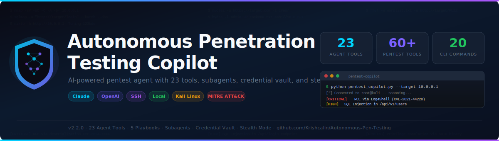

# Autonomous Penetration Testing Copilot

<p align="center">
  
</p>

<p align="center">
  <strong>AI-powered pentest agent with autonomous recon, vulnerability validation, exploit analysis, finding correlation, and kill chain tracking</strong><br>
  30 agent tools &bull; 60+ pentest tools &bull; 5 playbooks &bull; 21 CLI commands &bull; 5,075 lines of Python
</p>

---

## Overview

A single-file Python agent that connects to a Kali/Parrot attack box via SSH (or runs locally), autonomously executes security tools, analyses output, plans next steps, stores credentials for reuse, spawns parallel subagents, sprays credentials across services, builds attack graphs, and documents findings — all driven by an LLM agentic loop with Claude or OpenAI.

| | |
|---|---|
| **File** | `pentest_copilot.py` |
| **Version** | 2.4.0 |
| **Lines** | ~5,075 |
| **Agent Tools** | 30 |
| **CLI Commands** | 21 |
| **Pentest Tools** | 60+ in registry |
| **Playbooks** | 5 (webapp, network, api, ad, cloud) |
| **Recon Pipelines** | 4 (full, quick, subdomain, stealth) |
| **Python** | 3.8+ |
| **Dependencies** | `anthropic` or `openai` + `paramiko` |
| **License** | MIT |

---

## Quick Start

```bash
# Install dependencies
pip install anthropic paramiko        # Claude (recommended)
pip install openai paramiko           # OpenAI alternative

# SSH to a remote Kali attack box
export ANTHROPIC_API_KEY=sk-ant-...
python pentest_copilot.py --target 10.0.0.1 \
    --ssh-host kali.local --ssh-user root --ssh-key ~/.ssh/id_rsa

# Run locally on a Kali/Parrot machine
python pentest_copilot.py --target 10.0.0.1 --local

# Stealth mode (rate limiting + IDS evasion flags)
python pentest_copilot.py --target 10.0.0.1 --local --stealth

# Use OpenAI GPT-4o
export OPENAI_API_KEY=sk-...
python pentest_copilot.py --target 10.0.0.1 --local \
    --provider openai --model gpt-4o

# Use any OpenAI-compatible endpoint (Ollama, vLLM, etc.)
python pentest_copilot.py --target 10.0.0.1 --local \
    --provider openai --model llama3 \
    --base-url http://localhost:11434/v1
```

---

## 30 Agent Tools

### Core (7)

| Tool | Description |
|------|-------------|
| `run_command` | Execute any bash command on the attack box |
| `run_script` | Write and execute Python scripts for custom exploits |
| `install_tool` | Install security tools on demand (apt, pip, go, git) |
| `read_file` | Read scan results, configs, exploit output |
| `write_file` | Create wordlists, exploit scripts, configs |
| `report_finding` | Document a vulnerability with severity, evidence, CVSS |
| `ask_user` | Ask for clarification, approval, or additional info |

### Tier 1 — Parallelism & State (6)

| Tool | Description |
|------|-------------|
| `spawn_subagent` | Spawn background agents for concurrent tasks |
| `store_credential` | Store discovered credentials for cross-service reuse |
| `list_credentials` | List all credentials in the vault |
| `open_shell` | Open a named persistent shell session |
| `run_in_shell` | Run a command in a specific named shell |
| `use_playbook` | Load a methodology playbook (webapp, network, api, ad, cloud) |

### Tier 2 — Detection & Exploitation (7)

| Tool | Description |
|------|-------------|
| `detect_tools` | Scan attack box for installed vs missing tools |
| `search_exploits` | Search ExploitDB for CVEs by service version |
| `start_listener` | Start a netcat reverse shell listener |
| `stop_listener` | Stop a running listener |
| `check_listener` | Check if a listener caught a connection |
| `generate_payload` | Generate reverse shell payloads (bash, python, nc, php, perl, powershell) |
| `run_phalanx_scanner` | Run a Phalanx Cyber scanner (SAST, API, Cloud, Nuclei) |

### Tier 3 — Methodology & Stealth (3)

| Tool | Description |
|------|-------------|
| `set_phase` | Track pentest progress across 5 methodology phases |
| `get_compliance_map` | Get OWASP Top 10, PTES, NIST 800-53, CWE mappings |
| `toggle_stealth` | Enable/disable rate limiting and IDS evasion |

### Tier 4 — Intelligence & Autonomy (4)

| Tool | Description |
|------|-------------|
| `run_recon_pipeline` | Auto-chain recon tools (full/quick/subdomain/stealth pipelines) |
| `smart_exploit_search` | Parse nmap output, search ExploitDB, rank exploits by reliability |
| `credential_spray` | Spray vault credentials against all discovered services via hydra (14 protocols) |
| `add_attack_step` | Record a kill chain step mapped to MITRE ATT&CK stages |

### Tier 5 — Validation, Analysis & Correlation (3)

| Tool | Description |
|------|-------------|
| `validate_finding` | Submit findings to 6-stage validation pipeline (inventory → analysis → sanity_check → ruling → feasibility → validated) |
| `analyze_exploit` | Score findings by Impact × Exploitability / Detection Time with P1-P4 priority ratings |
| `correlate_findings` | Cross-tool deduplication — groups findings by host+port+CVE, boosts confidence when multiple tools agree |

---

## 4 Autonomous Recon Pipelines

| Pipeline | Tools Chained | Use Case |
|----------|--------------|----------|
| **full** | nmap → whatweb → wafw00f → nikto → ffuf → nuclei | Comprehensive target assessment |
| **quick** | nmap → whatweb → ffuf | Fast initial sweep |
| **subdomain** | subfinder → httpx | Domain-level attack surface mapping |
| **stealth** | nmap (slow SYN) → whatweb | Evasive reconnaissance |

Each pipeline auto-captures evidence, respects stealth mode, and returns aggregated output.

---

## 5 Methodology Playbooks

| Playbook | Name | Phases |
|----------|------|--------|
| `webapp` | Web Application Pentest | Recon, Content Discovery, Vuln Scanning, Exploitation, Report |
| `network` | Network Penetration Test | Host Discovery, Service Enum, Vuln Assessment, Exploitation, Post-Exploit |
| `api` | API Security Assessment | API Discovery, Auth Testing, Input Validation, Business Logic, Report |
| `ad` | Active Directory Assessment | AD Recon, Credential Attacks, Lateral Movement, Priv Esc, Domain Dominance |
| `cloud` | Cloud Security Assessment | Cloud Recon, IAM, Services, Data Exfiltration, Report |

---

## Attack Graph / Kill Chain Tracker

Records the attack path across 11 MITRE ATT&CK stages:

```
Initial Access → Execution → Persistence → Privilege Escalation →
Defense Evasion → Credential Access → Discovery → Lateral Movement →
Collection → Exfiltration → Impact
```

Use `add_attack_step` to document each step. View with `/attack` CLI command.

---

## Credential Spray Engine

Automatically tries all vault credentials against all discovered services:

| Supported Protocols |
|---------------------|
| SSH, FTP, HTTP, HTTPS, SMB, RDP, MySQL, MSSQL, PostgreSQL, Telnet, VNC, SMTP, POP3, IMAP, LDAP |

Uses hydra under the hood. Respects stealth mode rate limiting.

---

## Vulnerability Validation Pipeline

Inspired by RAPTOR's multi-stage approach. Every raw finding passes through 6 stages before becoming a confirmed vulnerability:

```
inventory → analysis → sanity_check → ruling → feasibility → validated
                                                                  ↓
                                                          report_finding
```

At each stage, the agent evaluates confidence and can reject false positives. Only **validated** findings get reported — eliminating noise from tools that cry wolf.

---

## Exploit Analysis Engine

Scores confirmed findings by **Impact × Exploitability / Detection Time** and assigns priority ratings:

| Priority | Risk Score | Action |
|----------|-----------|--------|
| **P1-IMMEDIATE** | ≥ 15 | Exploit now — high-impact, low-effort |
| **P2-HIGH** | ≥ 8 | Public exploit available or high value target |
| **P3-MEDIUM** | ≥ 3 | Document, attempt if time permits |
| **P4-LOW** | < 3 | Log as informational |

**8 exploitability modifiers**: public_exploit, auth_required, network_accessible, local_only, user_interaction, no_interaction, default_creds, version_match.

---

## Finding Correlation Engine

When multiple tools (nmap, nikto, nuclei, etc.) report the same issue, correlation:
- **Deduplicates** findings by host + port + CVE or normalized title
- **Boosts confidence** — 1 tool = 50%, 2 tools = 80%, 3+ tools = 95%
- **Selects best severity** — highest severity across tools wins
- **CVE matching** — strongest correlation signal

```
nmap  ──┐
nikto ──┤──→ Correlator ──→ 15 raw → 8 unique (47% dedup)
nuclei ─┘                   3 multi-tool confirmed (95% confidence)
```

---

## 60+ Pentest Tool Registry

| Category | Tools |
|----------|-------|
| **Reconnaissance** | nmap, masscan, subfinder, httpx, whatweb, amass, theHarvester, dnsrecon, wafw00f, whois |
| **Web Application** | nikto, ffuf, gobuster, dirsearch, nuclei, katana, wpscan, sqlmap, dalfox, feroxbuster |
| **Exploitation** | metasploit, searchsploit, ghauri, commix, hydra, medusa, john, hashcat, crackmapexec, impacket |
| **Post-Exploitation** | linpeas, winpeas, pspy, chisel, ligolo-ng, bloodhound, mimikatz, evil-winrm |
| **Network & Wireless** | netcat, socat, tcpdump, wireshark, responder, bettercap, aircrack-ng |
| **OSINT** | sherlock, recon-ng, spiderfoot, waybackurls, gau, photon |
| **Utilities** | curl, wget, jq, python3, git, gcc, proxychains |

---

## 21 CLI Commands

| Command | Description |
|---------|-------------|
| `/help` | Show available commands |
| `/target [new]` | Show or change the target |
| `/scope [new]` | Show or change the scope |
| `/tools` | List all 60+ pentest tools |
| `/findings` | Show discovered findings |
| `/creds` | Show credential vault |
| `/shells` | Show active named shells |
| `/subagents` | Show background subagent status |
| `/playbooks` | List methodology playbooks |
| `/listeners` | Show active reverse shell listeners |
| `/phalanx` | List Phalanx Cyber scanners |
| `/detect` | Scan attack box for installed tools |
| `/progress` | Show pentest phase progress |
| `/evidence` | Show evidence capture summary |
| `/stealth` | Toggle stealth mode on/off |
| `/attack` | Show attack graph / kill chain |
| `/history` | Show command execution history |
| `/save [file]` | Save session to JSON |
| `/report [base]` | Generate JSON + HTML pentest report |
| `/clear` | Clear conversation history |
| `/quit` | Exit the copilot |

---

## CLI Reference

```
usage: pentest_copilot [-h] --target TARGET [--scope SCOPE] [--objective OBJ]
                       (--local | --ssh-host HOST) [--ssh-port PORT]
                       [--ssh-user USER] [--ssh-key KEY] [--ssh-password PASS]
                       [--provider {claude,openai}] [--model MODEL]
                       [--api-key KEY] [--base-url URL]
                       [--auto-approve] [--stealth] [--stealth-delay SEC]
                       [--max-iterations N] [--load-session FILE] [--version]
```

---

## Architecture

```
pentest_copilot.py  (5,075 lines)
│
├── LLM Providers
│     ├── ClaudeProvider           — Anthropic Claude with tool calling
│     └── OpenAIProvider           — OpenAI / Ollama / vLLM compatible
│
├── Execution Engines
│     ├── SSHExecutor              — paramiko SSH to remote attack box
│     └── LocalExecutor            — subprocess on local machine
│
├── Agent Tools (30)
│     ├── Core (7)                 — run_command, run_script, install_tool,
│     │                              read/write_file, report_finding, ask_user
│     ├── Parallelism (3)          — spawn_subagent, open_shell, run_in_shell
│     ├── Credential Vault (2)     — store_credential, list_credentials
│     ├── Methodology (1)          — use_playbook
│     ├── Detection (3)            — detect_tools, search_exploits, run_phalanx
│     ├── Reverse Shell (4)        — start/stop/check_listener, generate_payload
│     ├── Tracking & Stealth (3)   — set_phase, get_compliance_map, toggle_stealth
│     ├── Intelligence (4)         — run_recon_pipeline, smart_exploit_search,
│     │                              credential_spray, add_attack_step
│     └── Validation & Analysis (3)— validate_finding, analyze_exploit,
│                                    correlate_findings
│
├── Supporting Systems (16 classes)
│     ├── CredentialVault          — thread-safe cred storage + reuse hints
│     ├── ShellManager             — named persistent shell sessions
│     ├── SubagentManager          — background parallel agent spawning
│     ├── ToolDetector             — installed tool scanning + caching
│     ├── ExploitSearcher          — searchsploit / nuclei CVE lookup
│     ├── ReverseShellHandler      — netcat listener + 7 payload generators
│     ├── ProgressTracker          — 5-phase methodology tracking
│     ├── EvidenceCollector        — auto-capture command outputs
│     ├── StealthController        — rate limiting + IDS evasion flags
│     ├── ReconPipeline            — 4 autonomous multi-tool pipelines
│     ├── SmartExploitSelector     — nmap parser + ExploitDB ranker
│     ├── CredentialSprayEngine    — hydra-based 14-protocol cred spray
│     ├── AttackGraph              — 11-stage MITRE ATT&CK kill chain
│     ├── VulnValidator            — 6-stage finding validation pipeline
│     ├── ExploitAnalyzer          — risk scoring + P1-P4 priority engine
│     └── FindingCorrelator        — cross-tool dedup + confidence boosting
│
├── PentestAgent (core loop)
│     ├── build_system_prompt()    — full context injection (16 systems)
│     ├── run_turn()               — agentic loop (up to 25 iterations)
│     └── Session save/load
│
├── Report Generation
│     ├── JSON report (findings + creds + attack graph + history)
│     └── HTML report (Catppuccin Mocha dark theme)
│
└── CLI Interface
      ├── Interactive chat loop
      ├── 21 slash commands
      └── Colored terminal output
```

---

## Version History

| Version | Lines | Agent Tools | CLI Commands | Key Features |
|---------|------:|:-----------:|:------------:|--------------|
| v1.0.0 | 1,656 | 7 | 10 | Core agent, SSH/local, Claude/OpenAI, safety controls |
| v2.0.0 | 2,468 | 13 | 14 | Subagents, credential vault, multi-shell, 5 playbooks |
| v2.1.0 | 3,095 | 20 | 17 | Tool detection, exploit search, reverse shells, Phalanx integration |
| v2.2.0 | 3,681 | 23 | 20 | Progress tracker, compliance mapping, evidence capture, stealth mode |
| v2.3.0 | 4,365 | 27 | 21 | Autonomous recon pipeline, smart exploit selection, credential spray, attack graph |
| **v2.4.0** | **5,075** | **30** | **21** | **Vulnerability validation pipeline, exploit analysis engine, finding correlation & dedup** |

---

## Example Session

```
You: Use the webapp playbook and run a full recon pipeline on http://10.0.0.1

[PLAYBOOK] Loaded: Web Application Pentest

[Agent] Starting with automated reconnaissance.

  [RECON PIPELINE] Running 'full' on http://10.0.0.1
  ──────────────────────────────────────────────────
  [RECON] nmap: nmap -sV -sC -O -p- 10.0.0.1 ...
    22/tcp   open  ssh     OpenSSH 8.2p1
    80/tcp   open  http    Apache httpd 2.4.41
    3306/tcp open  mysql   MySQL 5.7.33
    [OK in 45.2s]

  [RECON] whatweb: whatweb 10.0.0.1 ...
    Apache 2.4.41, PHP 7.4.3, WordPress 5.7
    [OK in 2.1s]

  [RECON] ffuf: ffuf -u 10.0.0.1/FUZZ ...
    /admin, /wp-login.php, /xmlrpc.php, /backup/
    [OK in 18.4s]

  [RECON] nuclei: nuclei -u 10.0.0.1 ...
    [critical] CVE-2021-44228 Log4Shell
    [high] CVE-2020-11023 jQuery XSS
    [OK in 32.1s]
  ──────────────────────────────────────────────────
  [RECON COMPLETE]

[Agent] Recon complete. Let me search for exploits on the discovered services.

  [TOOL] smart_exploit_search: parsing services...
  Found 3 services. Searching ExploitDB...
   1. [METASPLOIT] Apache 2.4.49 Path Traversal (80/http)
   2. [REMOTE] MySQL 5.7 Auth Bypass (3306/mysql)
   3. [WEBAPP] WordPress 5.7 RCE (80/http)

  [TOOL] credential_spray: 10.0.0.1 — 3 services
  ──────────────────────────────────────────────────
  admin@ssh:22 ... failed
  admin@mysql:3306 ... SUCCESS
  ──────────────────────────────────────────────────

  [CRED] Stored: admin:P@s*** [password] @ mysql://10.0.0.1:3306

  [ATTACK GRAPH] [Initial Access] SQL Injection in /login
  [ATTACK GRAPH] [Credential Access] MySQL creds via brute-force

  [FINDING] [CRITICAL] SQL Injection in login form
  [FINDING] [HIGH] MySQL default credentials
```

---

## Environment Variables

| Variable | Description |
|----------|-------------|
| `ANTHROPIC_API_KEY` | API key for Claude |
| `OPENAI_API_KEY` | API key for OpenAI |
| `DEBUG` | Set to any value to show full tracebacks |

---

## Related Projects

| Project | Description |
|---------|-------------|
| [Static-Application-Security-Testing](https://github.com/Krishcalin/Static-Application-Security-Testing) | SAST scanners (Java, PHP, Python, MERN, LLM) |
| [Dynamic-Application-Security-Testing](https://github.com/Krishcalin/Dynamic-Application-Security-Testing) | DAST scanner with 58 checks |
| [API-Security](https://github.com/Krishcalin/API-Security) | API security scanner, 112+ rules |
| [AWS-Security-Scanner](https://github.com/Krishcalin/AWS-Security-Scanner) | CloudFormation + Terraform IaC scanner |
| [Windows-Red-Teaming](https://github.com/Krishcalin/Windows-Red-Teaming) | Windows ATT&CK red teaming framework |
| [Detection-Engineering](https://github.com/Krishcalin/Detection-Engineering) | SIEM detection rules |
| [Oracle-EBS-Security-Audit](https://github.com/Krishcalin/Oracle-EBS-Security-Audit) | Oracle EBS security audit (live DB + offline CSV) |

---

## License

MIT License — see [LICENSE](LICENSE) for details.
